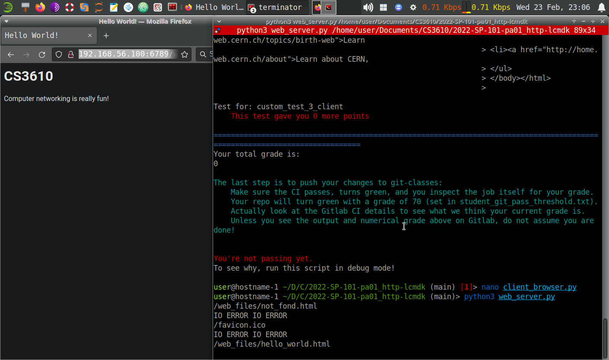
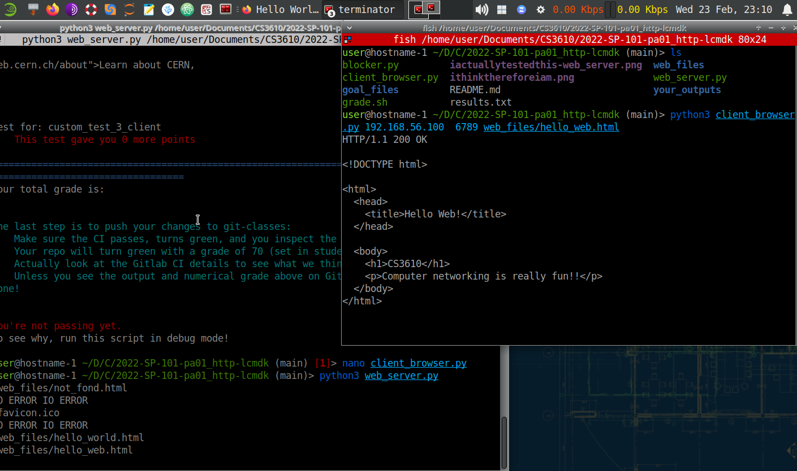

My setup was difficult and tedious. I had to make sure I was parsing correctly.
Afterwards, I would set up the connection and the requests. After following
protocol, it would send and receive data (packets) which I would then decode
and encode to actually see them or send them. I did have to import typing to 
fix one thing. 

This screenshot showcases how I connected my web server program to a request
from a browser.

This screenshot showcases how I connected my web server program to my
client side program. 
