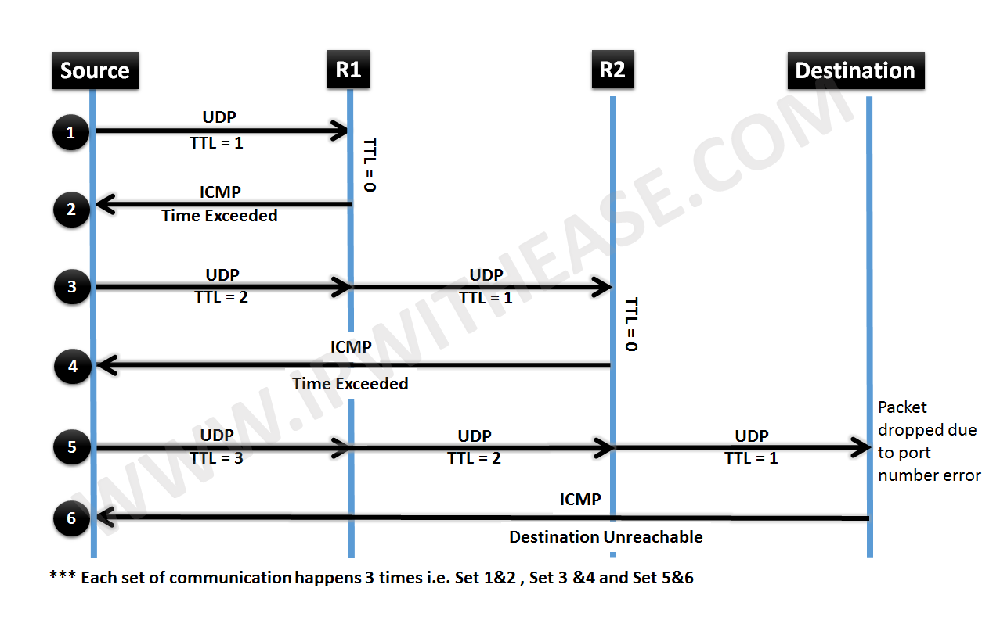
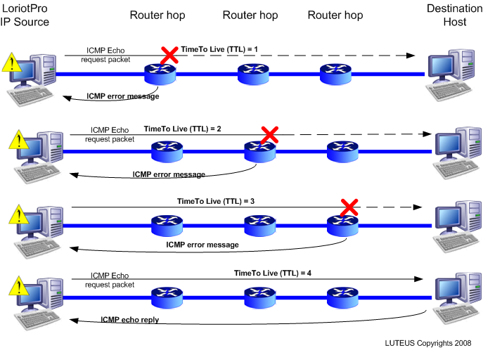
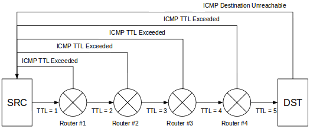
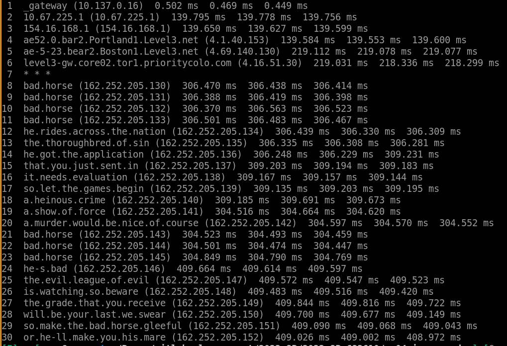

# PA04 - ICMP ping and traceroute using scapy


## Background
* Review your previous assignment:
	* `pa03_udp-echo`
* Read: 
	* https://en.wikipedia.org/wiki/Traceroute
    * https://www.reddit.com/r/ProgrammerHumor/comments/7eup2v/traceroute_badhorse/

    ```bash
    whatis traceroute
    which traceroute
    man traceroute
    traceroute --help
    traceroute 127.0.0.1
    traceroute mst.edu
    traceroute mit.edu
    traceroute epfl.ch
    traceroute bad.horse
    ```


 





* I'm giving you ICMP socket-based implementations of ping completed, with code in your repo.
* These are more realistic implementations of `ping` than our last `pa03_udp-echo`.
* There is also an ICMP socket-based implementation of `traceroute`.
* In this assignment, using scapy, you will re-create:
    1. A version of your last `pa03_udp-echo` but instead of using `socket.` you will use `scapy` only, and
    2. A program to mimic ICMP-ping using only scapy (no socket), and perhaps
    3. ICMP-traceroute (bonus points, replace your lowest paNN or raNN assignment).

Notes: 
* Don't use the python `socket` at all!
* There is a traceroute functionality in scapy, but don't use it!
* Try to mimic it using the ICMP packets alone, though it would not hurt to try both.

# Steps
1. Learn python3-scapy by reading the following:
	* https://scapy.readthedocs.io/en/latest/
    * https://github.com/0xbharath/art-of-packet-crafting-with-scapy
	* https://github.com/secdev/scapy (section of README.md called "Resources" has a couple iPython notebook tutorials)
	* Note: if you want to spoof packets, write network utilities, etc., scapy is better to try before raw sockets.
2. Read and run the code provided for these using raw sockets. 
   Notice how much the little details matter (if you break even the checksum, responses don't come back)!
3. Mimic basic ping and basic traceroute using scapy (notice how much easier it is for ICMP!).

Note: 
* Some websites might not want to respond to UDP/TCP/ICMP packets, and thus not regular ping/traceroute on different platforms.
* Also, your ISP may censor such packets on the source end too.
* So, you may need to try different sites on different internet connections to test. 

# Deliverables
Submit these files/edits, for example:
* `udp_echo_client_scapy.py mst.edu`
	* should produce what your last `pa03_udp-echo` assignment produced.
* `icmp_ping_client_scapy.py mst.edu`
	* should produce essentially what normal `ping` produces.
* `icmp_traceroute_client_scapy.py mst.edu`
	* should produce essentially what normal `traceroute` produces
    * This one is bonus.
* `/unit_tests/` has a smaller bonus you can check out.
* `report.md` which includes markdown-embedded images of how you ran your code, and what success looked like, along with any brief notes you want me to know.

# Bonus
While I did code a quick solution to this one in scapy, to confirm it's reasonable, there is no autograder for the traceroute.
If you complete it, let me know, and I'll grade it manually!
When you trace the public `bad.horse` hostname, it should look like this:


