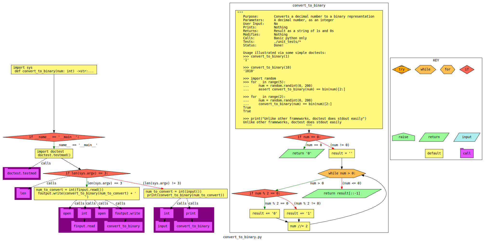

"Think Global, Code Local"
    - Me


# Programming Assignmeng 00 (pa00)
Get comfortable with a local development environment, version control, programm I/O, and the autograder.
This is a pre-assignment assignment, to make sure you know how to handle the environment, before we do real work.

# Part 0: Review the basics
Actually review the following (you should know this already, but if not, now is the time!):
* https://www.cnsr.dev/index_files/Classes/DataStructuresLab/Content/00-VirtualMachines.html
* https://www.cnsr.dev/index_files/Classes/DataStructuresLab/Content/01-02-LinuxBash.html
* https://www.cnsr.dev/index_files/Classes/DataStructuresLab/Content/03-VersionControl.html
* https://www.cnsr.dev/index_files/Classes/CompProblemSolving/Content/18-InputOutput.html
* https://www.cnsr.dev/index_files/Classes/CompProblemSolving/Content/11-TypeHints.html

# Part 1: Set up your machine
Follow instructions here:
https://www.cnsr.dev/index_files/Classes/DataStructuresLab/Content/00-VirtualMachines.html
In networking, I recommend Fedora or Fedora Security Labs (your choice of desktop environment) for many of the server setups.
But, you may want a decent VM to develop socket programming in, and the pre-configured OpenSuse OVA I give out is nice for that (it'd also make a good client VM).

# Part 2: Get your repository onto your machine
1. In your VM OS, open Firefox, and log into https://git-classes.mst.edu using your MST SSO credentials.
2. In git-classes, find the repository for this assignment, note the blue "clone" button/link; you want the https one, not the git@ one for now (unless you know what ssh keys are and how to use them).
3. In your class VM, open a terminal, and run these commands:
```sh
cd
tree 
cd Documents/CS****/ # where **** is your class (create if needed)
git clone https://git-classes.mst.edu.....thelinkyoucopiedatthegitstepabove
cd therepodirectoryyoujustcloned
```
In case it was not clear, you need to replace parts of the commands above with information specific to you.

# Part 3: Run the auto-grader
Run the following in the root directory of your repository:
`./grade.sh`

## Errors
You should not change any of the grading files themselves. 
If you do, you will see a warning, and it will give you a 0.
If you accidentally did that:
`git checkout firstfourcharactersoflastcommitbyus graderfileyoubroke`

## Is the auto-grader broken?
Is the error you're encountering our fault or yours?
Either may be possible, while the latter is much more likely.
Double-check all the diffs, and step through all code to see.
If you think you found a bug, please let us know!

# Part 4: Do the assignment

## How to code?
Let the autograder guide you! 
It's usually a good idea to do work in the order the autograder checks you.
Using this script, we strongly encourage you to program incrementally. 
Program code required by the unit tests, in the requested order. 
In general, don't procede to a later function, if you are not passing the first one.
If you get stuck, instead of moving on, get help!
See the syllabus for extended coding tips.

## Sample problem description
An introductory assignment: Convert to Binary

### Problem description
Write a function that converts decimal to binary, stripping leading 0s.
Write a main driver that uses this function, and handles various methods of input and output.
It will be expeted to have a variety of input and output mechanisms, which you can see with the autograder.

### Control Flow Graph (CFG) generated from your code

This is a big hint (you should probably check this out)!

# Part 5: Play with the debugger
1. pudb
```sh
man pudb # or man pudb3 depending on your machine
pudb convert_to_binary.py
```
Practice stepping into the function and through the for loop with pudb3.
Take a screenshot while you are still in pudb3 (before quitting), and name it `image_py-debug1.png`

2. Open the same file in Spyder3 and practice stepping through it using the debugger 
(read the manual for help).
Take a screenshot and name it `image_py-debug2.png`

# Part 6: Try some diff methods
In the virtual machine, run at the bash command line:
```sh
diff -y --color "unit_tests/unit_test_1.py" "unit_tests/unit_test_10.py"

vim -d "unit_tests/unit_test_1.py" "unit_tests/unit_test_10.py"
# To exit vim, type esc followed by :qa

meld --diff "unit_tests/unit_test_1.py" "unit_tests/unit_test_10.py"
```
Take a screenshot of the result of these commands arranged in view, and name it `image_diff.png`
caPitAliZAtiOn matters, including of the `.png` part. 
Check it!

# Part 7: Basic virtual network
Learn how to interact with a headless server...

https://en.wikipedia.org/wiki/Headless_computer

## Summary: 
If you don't have two VMs, then clone your VM (there should be two), set up a virtual network between the two machines, setup ssh, and ssh from one VM to the other.

This particular task is very common: 
For example, you get a VPS ( https://en.wikipedia.org/wiki/Virtual_private_server ) or remote machine at a company,
setup the basic OS, install SSH, and begin your remote administration. 
This is the foundation of remote headless server management. 

Note: this part of the assignment is intentionally somewhat open-ended.
One of the goals is to get some practice finding guides/how-to documents to complete a task, filtering out the junk, and finding a modern and correct solution among those that are not. 
Having to execute such a task from merely high-level instructions is a very common task at work!

You've all ssh'ed before -- recall putty and cssubmit?

1. Learn some background information:
    * Fully read the following documentation on virtual networking in VirtualBox: 
        * https://www.virtualbox.org/manual/ch06.html 
        * https://blogs.oracle.com/scoter/networking-in-virtualbox-v2

    * Watch some videos on VirtualBox virtual networks and ssh:
        * https://www.youtube.com/watch?v=S7jD6nnYJy0
        * https://www.youtube.com/results?search_query=virtualbox+ssh+ 

    * Read some articles on the same: 
        * https://access.redhat.com/documentation/en-us/red_hat_enterprise_linux/8/html/securing_networks/assembly_using-secure-communications-with-openssh-securing-networks
        * https://linuxhint.com/enable-ssh-server-debian/ 
        * https://duckduckgo.com/?q=virtualbox+ssh+fedora+guest+to+guest 
        * https://duckduckgo.com/?q=ssh+server+fedora

2. Set up the network
    * If/when you clone your VM, read about whether or not you should update the MAC address of the NIC in the new VM you cloned.
    * Configure VirtualBox network settings for each VM, and VM internal network settings (if needed).
    * Make sure you can https://en.wikipedia.org/wiki/Ping_(networking_utility) between the two guest machines.
    * Install ssh server in one machine, enable it, reboot.
    * Test the ssh server by ssh'ing from one guest to the other guest machine.

3. Wireshark
    * Launch Wireshark as root: `sudo wireshark` and start capturing!
    * What does the SSH traffic look like through Wireshark?
    * Capture the traffic, saving it as the default (pcapng) format, named `captured_packets.pcapng`

4. Write a report, `report.md`:
    * Which VirtualBox networking mode did you use? Why? Justify the logic.
    * What did you do with the MAC addresses of the VMs when you cloned? Why?
    * Include a screenshot of each of your VMs' network settings. Describe what the fields in your screenshot mean.
        * Actually embed these screenshots in the markdown document (https://docs.gitlab.com/ee/user/markdown.html#images).
    * How did you install and configure your ssh server? What does each sub-step of installation and configuration do?
    * Include screenshots of successfully sshing from one machine to the other.

# Part 8: Submit your work!
Finally, to submit all your work, it is time to manage these files you created within your Git repository.
They must all be in the folder created when you cloned your Git repository.
From within your git repository (folder), add, commit, and push all the non-generated files. 
This means add your cpp and py files, for example, but not a.out, etc.
These commands should move your edits to the repository to the git-classes server:
```sh
git add file1
git add file2
# where you do this for all your files
git commit -m "Time to git committed to this ;)"
git push -u origin master
```

# Part 9: Check your work!
Read the resulting message Git prints!
Most importantly, to check all your previous Git-related steps worked, using the web browser, navigate back to the repository, and confirm all the files you added are visible in the Gitlab web interface.
If the files are not visible, you will not be graded for them, and you should go ask for help!
If you can see the correct files on git-classes in your master branch, your push is complete.
Make sure all the requested files are in the root directory of the repository unless otherwise specified.

To determine whether your project is finished:
Check out the git-classes Gitlab CI (details in the general syllabus). 
If it turns green AND the details show a 100, then you're good! 
If it's still red or you are less than 100, you need to fix your project.
This test checks both that you got your files submitted correctly, and that your submission was correct!

## How to make sure I'm getting points?
* Click on CI/CD -> Jobs -> the latest job.
* What grade does it say you have?
* Whatever grade the latest job says, is what we think you have!
