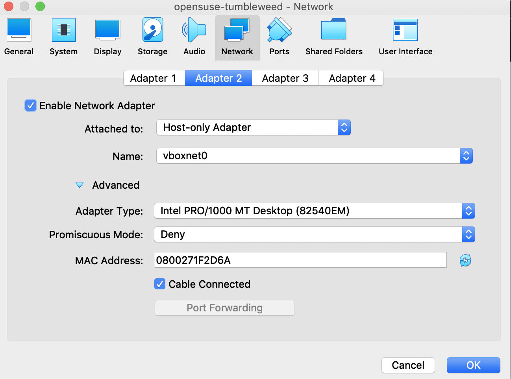
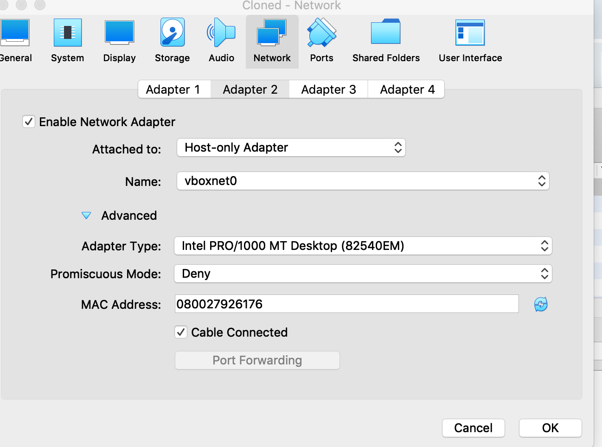

The networking mode I utilized was host-adapter becauses it allows for
the basic utility needed to network. I interweave all my VM's with each 
other and the host machinne. It provides easy access to any of my files
and allows me to play around with a machine with little to no consequences.

The MAC addresses automatically changed becauses they each distribution
needs to be unique in order to network correctly.

Fields In Image
Network Adapter: This specifies what type of adapter it is which
allows the VM to interact with a network. 
Adapter Type: This just specifices the adapter used.
Promiscuous Mode: A mode of operation that includes security,
monitoring, and administration techniques.
MAC Address: An extremely unique address that identifies media devices.

Installing and configuring the ssh server was slightly difficult and 
tedious. I had to download and/or update multiple dependicies such as
ifconfig. I also had to take down the firewalls associated with each
VM, so it could connect with each other. Afterwards, I had to set up 
the network and the ip addresses specifically on enp0s8 which would be 
the host adapter's address. Afterwards, I would reboot and run the ssh
which succesfully connected and I could access the other VM's files.

Below is an image of succesfully ssh-ing into the VM's:

