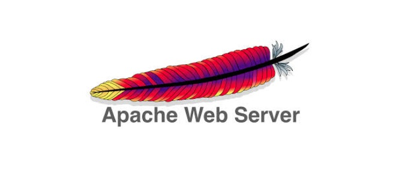
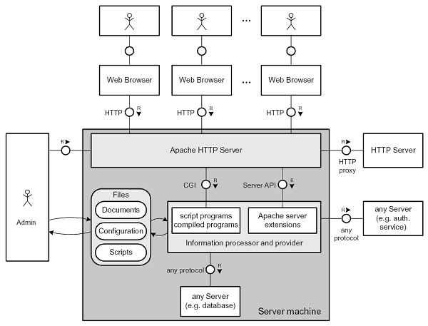

# Real assignment 1 (ra01)
Set up a real web server!

## Deliverables
* `apache_setup.sh`
* `iactuallytestedthis-apache_setup.png`
* `wireshark_cap_web.pcapng`
* `report.md`

## Part 0: 
Watch:
* https://www.youtube.com/watch?v=JUt2nb0mgwg

Read some general background on Apache:
* https://www.apache.org/
* https://httpd.apache.org/
* https://en.wikipedia.org/wiki/Apache_HTTP_Server

Specific information about administering Apache
* https://httpd.apache.org/docs/2.4/

Apache on Fedora:
* https://docs.fedoraproject.org/en-US/fedora/rawhide/system-administrators-guide/servers/Web_Servers/
* https://docs.fedoraproject.org/en-US/quick-docs/getting-started-with-apache-http-server/index.html
* https://access.redhat.com/documentation/en-us/red_hat_enterprise_linux/8/html-single/deploying_different_types_of_servers/index#setting-apache-web-server_Deploying-different-types-of-servers

Apache on Debian:
* https://wiki.debian.org/Apache

Note: 
You don't have to do Debian and Fedora implementations locally.
It is much easier to develop and test this assignment locally, and the gitlab CI/CD is Debian-like, so you can choose which OS you prefer.

## Part 1: Install and configure a real Web server
* Using your VM install and set up an Apache web-server.
* Install Apache, enable Apache, check out the default website.
* Firewall configuration will depend on your setup.
* Create various html files and scripts in the required directories.
* Verify it's functionality by visiting your new website from localhost
* Visit your web server running in one VM, from the other VM.
* Verify it's visibility and availability by visiting your new website from another one of your virtual machines.

## Part 2: Wireshark for HTTP details!
* Start up Wireshark, observe the traffic from queries to your new website.

In the `report.md` answer these questions:
* Is the traffic TCP or UDP?
* Follow a TCP "stream"
* Can you read the HTTP data?
* Is it encrypted?

## Part 3 CGI?

Set up server-side code execution, GET input
* https://httpd.apache.org/docs/2.4/howto/cgi.html
* https://www.tutorialspoint.com/python/python_cgi_programming.htm
* https://wiki.debian.org/CGI
* After completing the basic parts, visit: http://localhost/python_post.html and enter something in the form!

## Part 3 (optional for fun)
* The only thing left to make this a real live site is to host publicially.
    * get an externally facing IP, and alternatively to get a domain name.
    * Or, get an externally facing onion or garlic address to host your site for free: 
        * https://2019.www.torproject.org/docs/tor-onion-service
        * https://geti2p.net/en/docs/applications/supported#web-servers

## Part 4: write up
Write a `report.md` which includes
* the above screenshots, so that they are visible in the git-classses web interface, and 
* descriptions of each screenshot
* any extra notes about your setup.
