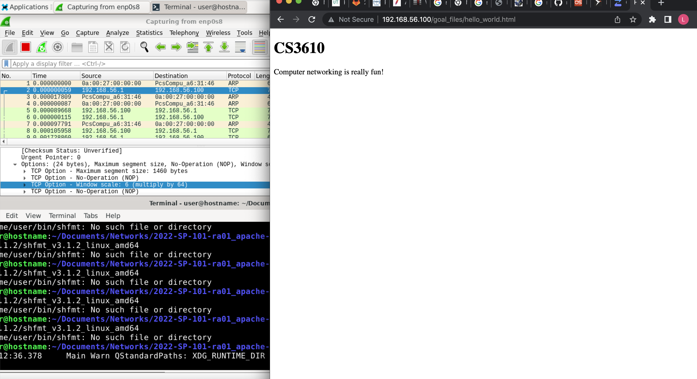

1. It is not encrypted, and is a TCP stream based off of my wireshark.
2. I do not believe you can read the http data.

The above screenshot shows how I can access my apache web server. It also
works with the cgi-bin/python.py directories as well.
